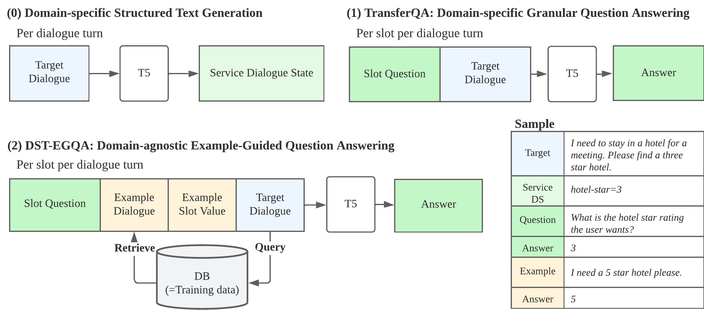

# Continual Dialogue State Tracking via Example-Guided Question Answering (EMNLP 2023)

This is the official code for ["Continual Dialogue State Tracking via Example-Guided Question Answering" (EMNLP 2023)](https://aclanthology.org/2023.emnlp-main.235/).



## Environment setup

```bash
git clone git@github.com:facebookresearch/DST-EGQA.git
cd DST-EGQA
conda create -n egqa python=3.8 #this repo requires >=3.7
conda activate egqa
pip install -r requirements.txt
pip install -e .
```

## Data setup

We use the continual learning setup using the Schema Guided Dialogue (SGD) dataset from [CPT4DST](https://github.com/thu-coai/CPT4DST). 

```bash
cd data 
git clone git@github.com:google-research-datasets/dstc8-schema-guided-dialogue.git
```

## Reproducing results in the paper 

Refer to `experiment_scripts/all_commands_for_paper.sh` for the commands to reproduce the results in the paper.


## License 

The majority of DST-EGQA is licensed under GPL-3, however portions of the project are available under separate license terms: CPT4DST is licensed under the Apache-2.0 license.

## Citation

If you use DST-EGQA in your work, please cite the following paper:

```
@inproceedings{cho-etal-2023-continual,
    title = "Continual Dialogue State Tracking via Example-Guided Question Answering",
    author = "Cho, Hyundong  and
      Madotto, Andrea  and
      Lin, Zhaojiang  and
      Chandu, Khyathi  and
      Kottur, Satwik  and
      Xu, Jing  and
      May, Jonathan  and
      Sankar, Chinnadhurai",
    editor = "Bouamor, Houda  and
      Pino, Juan  and
      Bali, Kalika",
    booktitle = "Proceedings of the 2023 Conference on Empirical Methods in Natural Language Processing",
    month = dec,
    year = "2023",
    address = "Singapore",
    publisher = "Association for Computational Linguistics",
    url = "https://aclanthology.org/2023.emnlp-main.235",
    pages = "3873--3886",
    abstract = "Dialogue systems are frequently updated to accommodate new services, but naively updating them by continually training with data for new services in diminishing performance on previously learnt services. Motivated by the insight that dialogue state tracking (DST), a crucial component of dialogue systems that estimates the user{'}s goal as a conversation proceeds, is a simple natural language understanding task, we propose reformulating it as a bundle of granular example-guided question answering tasks to minimize the task shift between services and thus benefit continual learning. Our approach alleviates service-specific memorization and teaches a model to contextualize the given question and example to extract the necessary information from the conversation. We find that a model with just 60M parameters can achieve a significant boost by learning to learn from in-context examples retrieved by a retriever trained to identify turns with similar dialogue state changes. Combining our method with dialogue-level memory replay, our approach attains state of the art performance on DST continual learning metrics without relying on any complex regularization or parameter expansion methods.",
}
```
